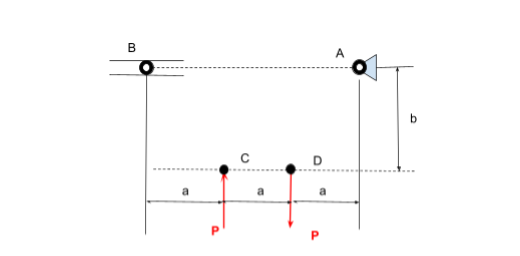
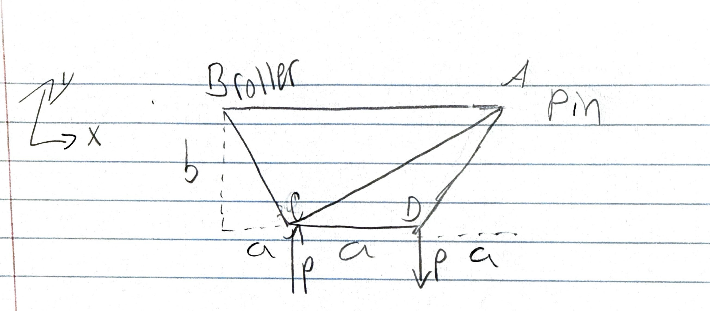
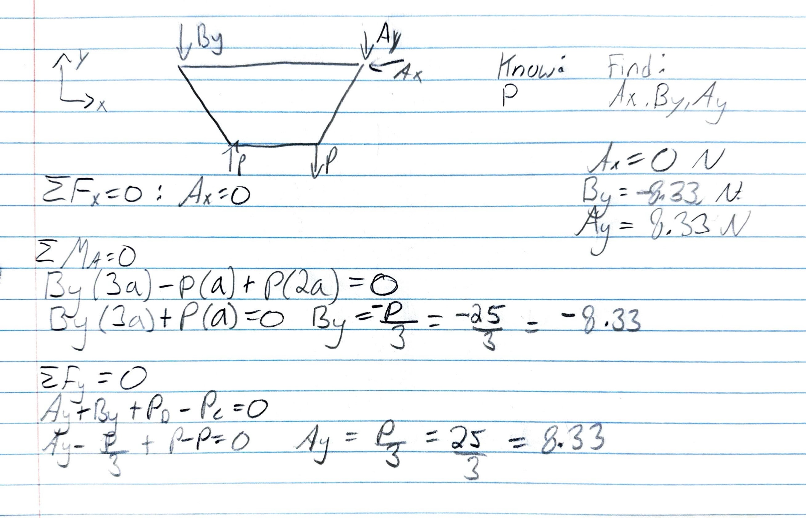
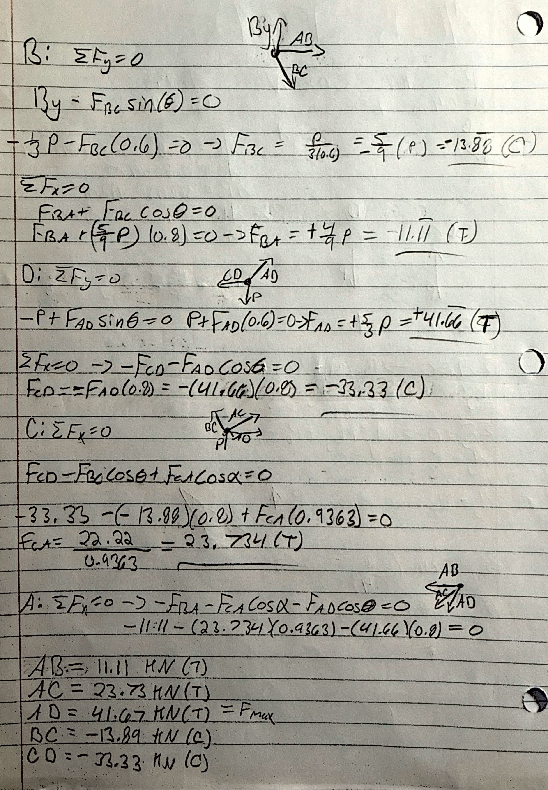
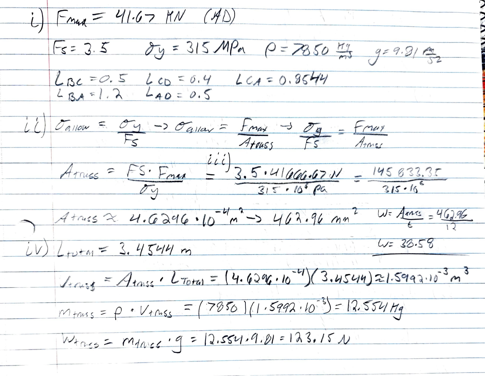
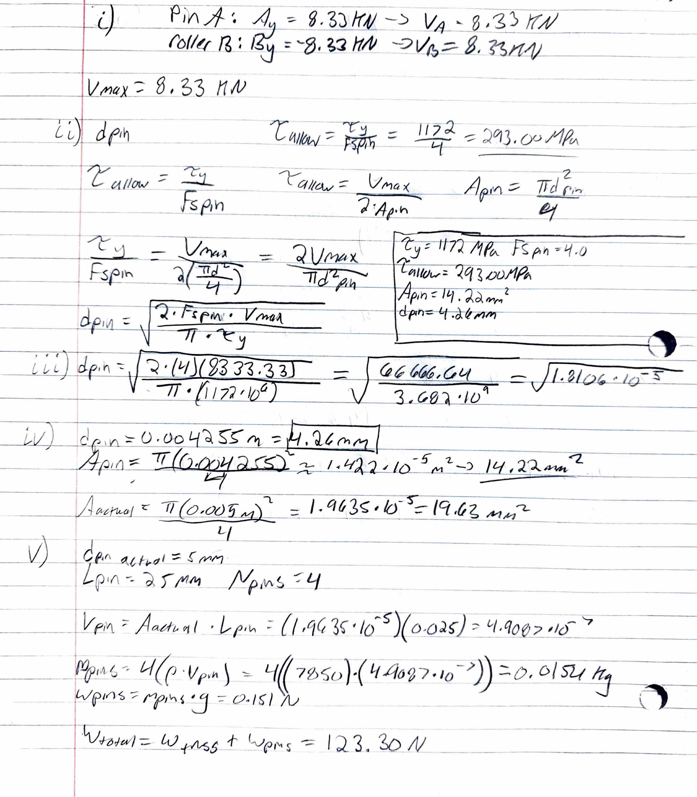

# A2 - Truss Stress Analysis

## Objective

The objective of this assignment was to design, analyze, size, and 3D model a trapezoidal plate truss system under specified conditions. The design requires evaluating static equilibrium, member axial forces, structural member sizing, double shear pin connections, alongside validating total theoretical mass against native 3D CAD mass properties.

---

## Analyze

  

*Figure 0: The beginning parameters were based off of this image*

---

### 1. Geometry & Load Identification

To establish the baseline layout of the truss, the spatial coordinates of all joints and external loading vectors were established relative to origin Node C (0, 0) m. Using design parameters **a = 0.4 m** and **b = 0.3 m**, the system geometry was mapped with a pin support at Joint A and a roller support at Joint B.

* **Joint C (Origin):** (0.00, 0.00) m
* **Joint B (Roller Support):** (-0.40, 0.30) m
* **Joint D (Applied Load Point):** (0.40, 0.00) m
* **Joint A (Pin Support):** (0.80, 0.30) m
* **Applied Forces (P):** +25 kN vertical force at Joint C and -25 kN vertical force at Joint D

  
*Figure 1: Global Free Body Diagram showing joint coordinates, support reactions, and external forces.*

---

### 2. Static Equilibrium & Support Reactions

Global static equilibrium equations were solved to determine the external reaction forces at support joints A and B. Taking the sum of moments about pin support A (ΣM_A = 0) determined the vertical reaction at roller joint B, followed by vertical (ΣF_y = 0) and horizontal (ΣF_x = 0) summations for joint A.

* **ΣM_A = 0**  ➔  **B_y = -8.333 kN** (acting downward)
* **ΣF_y = 0**  ➔  **A_y = +8.333 kN** (acting upward)
* **ΣF_x = 0**  ➔  **A_x = 0.000 kN**

  
*Figure 2: Handwritten static equilibrium equations for external support reactions.*

---

### 3. Internal Member Force Analysis (Method of Joints)

Internal axial forces for all five members were systematically calculated using the Method of Joints, starting at Joint B and resolving vector equilibrium through Joints D, C, and A.

* **Member BC:** F_BC = -13.89 kN (Compression)
* **Member CD:** F_CD = +11.11 kN (Tension)
* **Member BA:** F_BA = -22.22 kN (Compression)
* **Member BD:** F_BD = 0.00 kN (Zero-force member)
* **Member AD:** F_AD = +41.67 kN (Tension) — **Peak Tensile Force**

  
*Figure 3: Method of joints force balance and vector breakdown.*

---

### 4. Structural Sizing Calculations

Structural member cross-sectional sizing was governed by peak tension member AD using A500 Structural Steel (σ_y = 350 MPa) with a required factor of safety FS_truss = 3.5.

* **Allowable Stress:** σ_allow = 350 MPa / 3.5 = **100 MPa**
* **Minimum Cross-Sectional Area:** A_truss = 41.67 kN / 100 MPa = **462.96 mm²**

  
*Figure 4: Allowable stress, factor of safety, and minimum cross-sectional area calculations.*

---

### 5. Joint & Pin Sizing Analysis

Support pin connections were evaluated under double shear conditions using hardened steel pins (τ_y = 1172 MPa) with a safety factor FS_pin = 4.0 based on the maximum shear force V_max = 8.333 kN.

* **Allowable Shear Stress:** τ_allow = 1172 MPa / 4.0 = **293.00 MPa**
* **Minimum Shear Area:** A_pin = 8.333 kN / (2 × 293.00 MPa) = **14.22 mm²**
* **Minimum Pin Diameter:** d_pin = **4.26 mm**

Rounding up to the nearest standard commercial component size yields a **d_pin = 5.00 mm** diameter pin.

  
*Figure 5: Double shear pin sizing and mass property math.*

---

## Decide

A single-plate truss topology was selected over a traditional multi-part tubular space frame assembly. Selecting a flat plate design allows the entire 5-member structure to be manufactured from a single piece of stock material, eliminating assembly alignment errors, reducing manufacturing complexity, and streamlining CAD construction into a single-sketch extrusion. 

To maintain the required cross-sectional area of A_truss = 462.96 mm² across all members while preserving structural rigidity against out-of-plane bending:

* **Selected Plate Thickness (t):** 12.00 mm
* **Derived Member Width (w):** 38.58 mm (38.58 mm × 12.00 mm = 462.96 mm²)
* **Node Joint Bosses:** 50.00 mm diameter circular pads centered at all four node coordinates to reinforce material surrounding the 5.00 mm reamed pin holes.

---

## Communicate

### CAD Modeling & Mass Property Verification

The 3D model was constructed in PTC Creo Parametric by sketching the continuous node framework, offsetting member boundaries symmetrically to w = 38.58 mm, adding 50 mm joint boss pads with concentric 5.0 mm pin holes, and extruding to a thickness of t = 12.0 mm. Standard A500 Structural Steel material properties (ρ = 7850 kg/m³) were assigned to the solid body.

Native Creo Mass Properties analysis confirmed a total part volume of 1.477 × 10⁶ mm³ and a total frame mass of **11.59 kg**, closely resembling the theoretical hand-calculated frame mass. Adding four 5.0 mm steel pins (0.015 kg) yields a total system assembly mass of **11.61 kg**.

  
*Figure 6: High-resolution CAD model of the single-plate extruded truss frame.*

  
*Figure 7: Creo Mass Properties window confirming part volume and mass verification.*

---

### 2157 Students Only: Likelihood of Failure Modes in Truss Components

#### Part 1 – Truss Members
The truss consists of A500 Structural Steel, which has a yield strength of σ_y = 350 MPa. The members can be grouped by their loading conditions (Tension vs. Compression).

**Tension Members (Members AD, CD)**
1. **Expected Failure Mode:** Yielding.
2. **Material Type:** A500 Steel is a **ductile** material.
3. **Support:** Because A500 steel is highly ductile, it will undergo significant plastic deformation (yielding) before reaching its ultimate tensile strength and physically breaking (fracture). The current peak tensile stress in Member AD is approximately 90 MPa (41.67 kN / 462.96 mm²), well below the 350 MPa yield point. Under extreme overloading, the stress would reach 350 MPa, causing the member to stretch rather than fracture abruptly.
4. **Design Modification:** To reduce the likelihood of yielding, increase the cross-sectional area of the members (e.g., increase the plate thickness to 15 mm, or member width to 45 mm). This distributes the internal force over a larger area, lowering the normal stress.

**Compression Members (Members BA, BC)**
1. **Expected Failure Mode:** Buckling (Macroscopic Instability).
2. **Material Type:** A500 Steel is a **ductile** material.
3. **Support:** While the material itself would fail by compressive yielding if it were a short, thick block, this design uses a flat plate geometry (12 mm thick). Slender compressive members subjected to axial loads are highly susceptible to Euler buckling. They will laterally deflect out-of-plane and collapse long before the internal compressive stress reaches the 350 MPa yield limit.
4. **Design Modification:** To prevent buckling, increase the Area Moment of Inertia (I) of the cross-section. This can be achieved by increasing the plate thickness, or much more efficiently, by changing the cross-section shape from a flat solid plate to a hollow square or circular tube, which naturally resists out-of-plane bending.

#### Part 2 – Pin Connections
The joint connections rely on hardened steel pins (5.00 mm diameter, τ_y = 1172 MPa) acting in double shear.

1. **Expected Failure Mode of the Pin:** Direct Shear Failure (or Shear Yielding).
2. **Support:** According to fundamental mechanics of materials (e.g., *Mechanics of Materials* by R.C. Hibbeler), pins subjected to transverse loads from connecting plates experience high internal shear forces. Because the plates pull in opposite directions, they act like scissors on the pin. If the applied load exceeds the pin's shear capacity, it will cleanly slice across its cross-section. Currently, the maximum shear force is 8.333 kN, causing a shear stress of roughly 212 MPa across the double-shear area, which is safely below the 1172 MPa limit.
3. **Design Modification:** The simplest way to reduce the likelihood of pin shear failure is to increase the pin diameter (e.g., from 5.00 mm to 8.00 mm). Because shear area is calculated as A = πr², even a small increase in radius quadratically increases the shear area, drastically reducing the internal shear stress.

* [Download Truss Frame Creo Part File (`truss_frame.prt`)](truss_frame1.prt)
* [Download Universal STEP File (`truss_frame.stp`)](truss_frame.stp)
