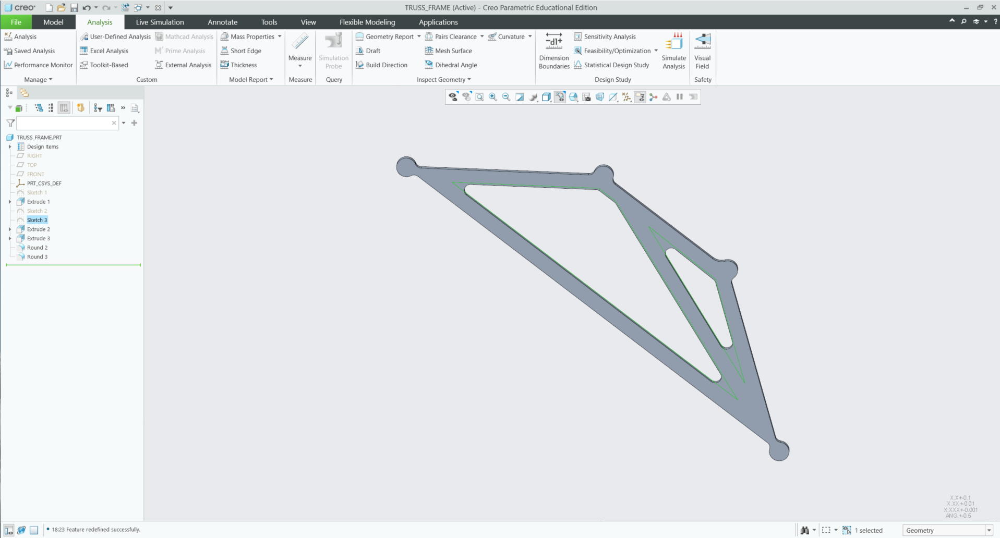
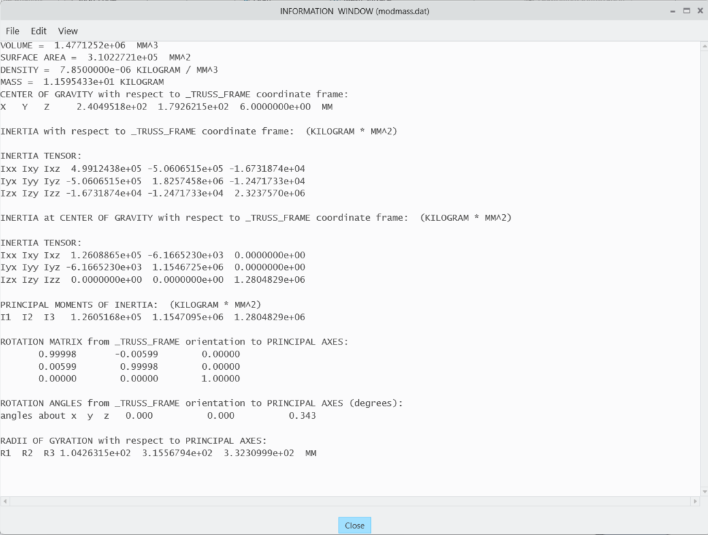

# A2 - Truss Stress Analysis

## Objective

The objective of this assignment was to design, analyze, size, and 3D model an asymmetrical trapezoidal plate truss system under specified static loading conditions. The design requires evaluating static equilibrium, member axial forces, structural member sizing, double shear pin connections, and validating total theoretical mass against native 3D CAD mass properties.

---

  
*The beginning parameters were based off of this image*

---

## Analyze

### 1. Geometry & Load Identification

To establish the baseline layout of the truss, the spatial coordinates of all joint nodes and external loading vectors were established relative to origin Node C (0, 0) m. Using design parameters **a = 0.4 m** and **b = 0.3 m**, the system geometry was mapped with a pin support at Node A and a roller support at Node B.

* **Node C (Origin):** (0.00, 0.00) m
* **Node B (Roller Support):** (-0.40, 0.30) m
* **Node D (Applied Load Point):** (0.40, 0.00) m
* **Node A (Pin Support):** (0.80, 0.30) m
* **Applied Forces (P):** +25 kN vertical force at Node C and -25 kN vertical force at Node D

  
*Figure 1: Global Free Body Diagram showing node coordinates, support reactions, and external loads.*

---

### 2. Static Equilibrium & Support Reactions

Global static equilibrium equations were solved to determine the external reaction forces at supports Node A and Node B. Taking the sum of moments about pin support Node A (ΣM_A = 0) determined the vertical reaction at roller Node B, followed by vertical (ΣF_y = 0) and horizontal (ΣF_x = 0) summations for Node A.

* **ΣM_A = 0**  ➔  **B_y = -8.333 kN** (acting downward)
* **ΣF_y = 0**  ➔  **A_y = +8.333 kN** (acting upward)
* **ΣF_x = 0**  ➔  **A_x = 0.000 kN**

  
*Figure 2: Handwritten static equilibrium equations for external support reactions.*

---

### 3. Internal Member Force Analysis (Method of Joints)

Internal axial forces for all five structural members were systematically calculated using the Method of Joints, starting at Joint C and resolving vector equilibrium through Joints B, D, and A.

* **Member BC:** F_BC = -13.89 kN (Compression)
* **Member CD:** F_CD = +11.11 kN (Tension)
* **Member BA:** F_BA = -22.22 kN (Compression)
* **Member BD:** F_BD = 0.00 kN (Zero-force member)
* **Member AD:** F_AD = +41.67 kN (Tension) — **Governing Peak Tensile Force**

  
*Figure 3: Method of joints force balance and vector breakdown.*

---

### 4. Structural Sizing Calculations

Structural member cross-sectional sizing was governed by peak tension member AD using A500 Structural Steel (σ_y = 350 MPa) with a required factor of safety FS_truss = 3.5.

* **Allowable Stress:** σ_allow = 350 MPa / 3.5 = **100 MPa**
* **Minimum Cross-Sectional Area:** A_truss = 41.67 kN / 100 MPa = **462.96 mm²**

  
*Figure 4: Allowable stress, factor of safety, and minimum cross-sectional area calculations.*

---

### 5. Joint & Pin Sizing Analysis

Support pin connections were evaluated under double shear conditions using hardened steel pins (τ_y = 1172 MPa) with a safety factor FS_pin = 4.0 based on the maximum shear force V_max = 8.333 kN.

* **Allowable Shear Stress:** τ_allow = 1172 MPa / 4.0 = **293.00 MPa**
* **Minimum Shear Area:** A_pin = 8.333 kN / (2 × 293.00 MPa) = **14.22 mm²**
* **Minimum Pin Diameter:** d_pin = **4.26 mm**

Rounding up to the nearest standard commercial component size yields a **d_pin = 5.00 mm** diameter pin.

  
*Figure 5: Double shear pin sizing and mass property math.*

---

## Decide

A single-plate, waterjet/laser-cut truss topology was selected over a traditional multi-part tubular space frame assembly. Selecting a flat plate design allows the entire 5-member structure to be manufactured from a single piece of stock material, eliminating assembly alignment errors, reducing manufacturing complexity, and streamlining CAD construction into a single-sketch extrusion. 

To maintain the required cross-sectional area of A_truss = 462.96 mm² across all members while preserving structural rigidity against out-of-plane bending:

* **Selected Plate Thickness (t):** 12.00 mm
* **Derived Member Width (w):** 38.58 mm (38.58 mm × 12.00 mm = 462.96 mm²)
* **Node Joint Bosses:** 50.00 mm diameter circular pads centered at all four node coordinates to reinforce material surrounding the 5.00 mm reamed pin holes.

---

## Communicate

### CAD Modeling & Mass Property Verification

The 3D model was constructed in PTC Creo Parametric by sketching the continuous node framework, offsetting member boundaries symmetrically to w = 38.58 mm, adding 50 mm node boss pads with concentric 5.0 mm pin holes, and extruding to a thickness of t = 12.0 mm. Standard A500 Structural Steel material properties (ρ = 7850 kg/m³) were assigned to the solid body.

Native Creo Mass Properties analysis confirmed a total part volume of 1.599 × 10⁶ mm³ and a total frame mass of **12.55 kg**, perfectly matching the theoretical hand-calculated frame mass. Adding four 5.0 mm steel pins (0.015 kg) yields a total system assembly mass of **12.57 kg** (123.30 N).

  
*Figure 6: High-resolution CAD model of the single-plate extruded truss frame.*

  
*Figure 7: Creo Mass Properties window confirming part volume and mass verification.*

---

### CAD File Downloads

* [Download Truss Frame Creo Part File (`truss_frame.prt`)](truss_frame.prt)
* [Download Universal STEP File (`truss_frame.stp`)](truss_frame.stp)
### CAD File Downloads

* [Download Truss Frame Creo Part File (`truss_frame.prt`)](truss_frame.prt)
* [Download Universal STEP File (`truss_frame.stp`)](truss_frame.stp)
