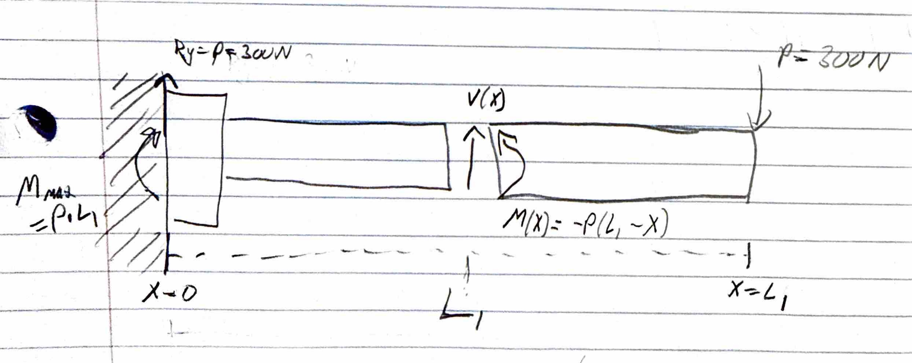
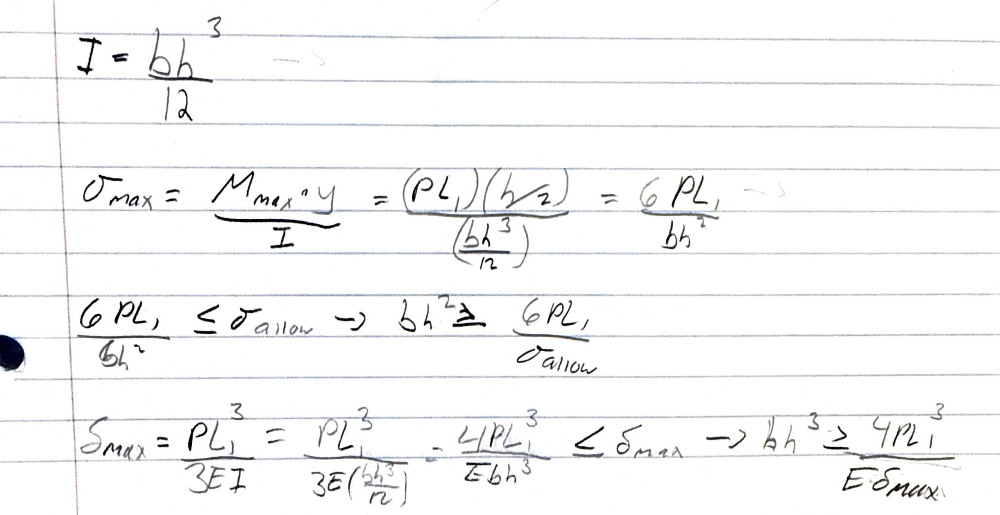
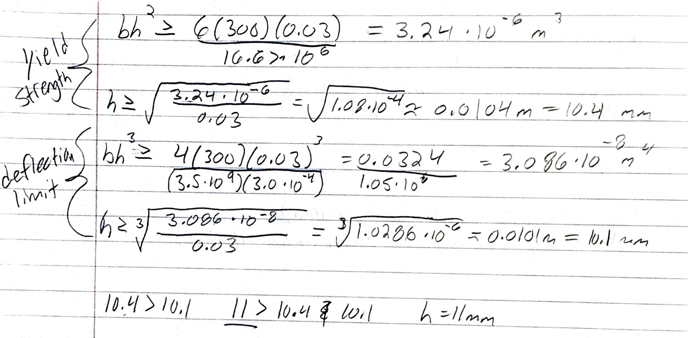
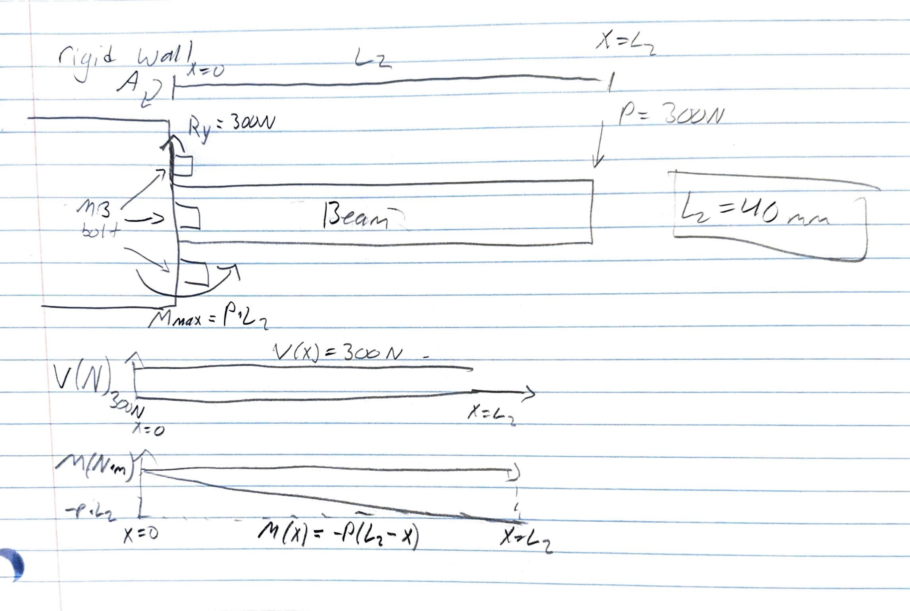
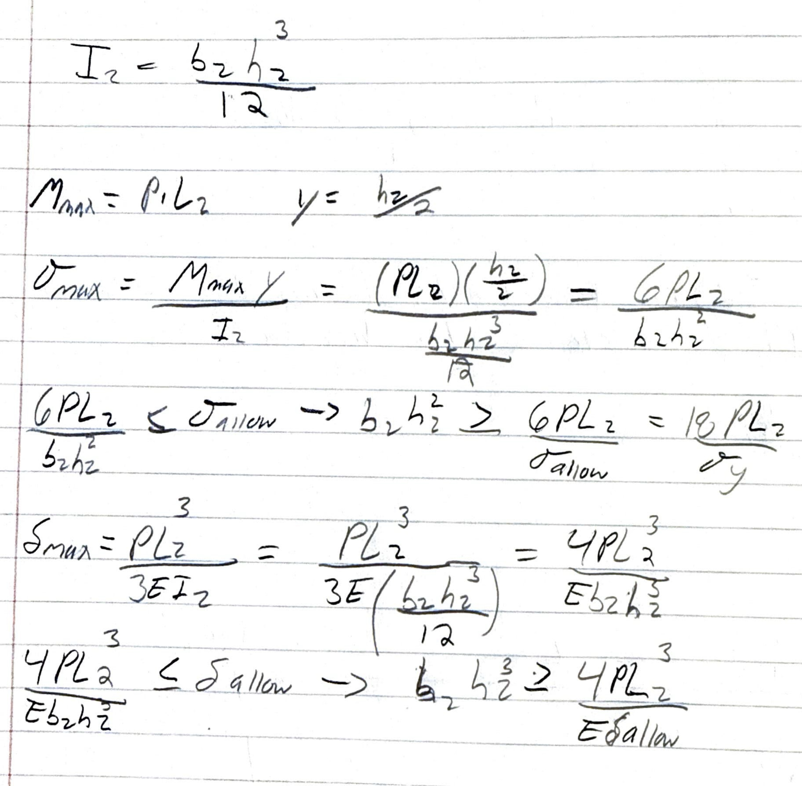
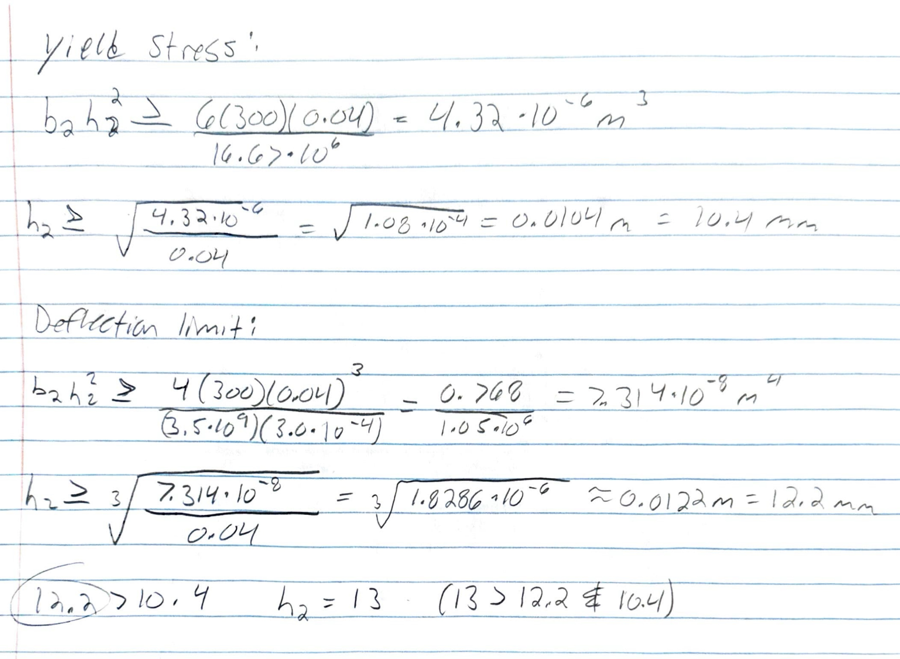
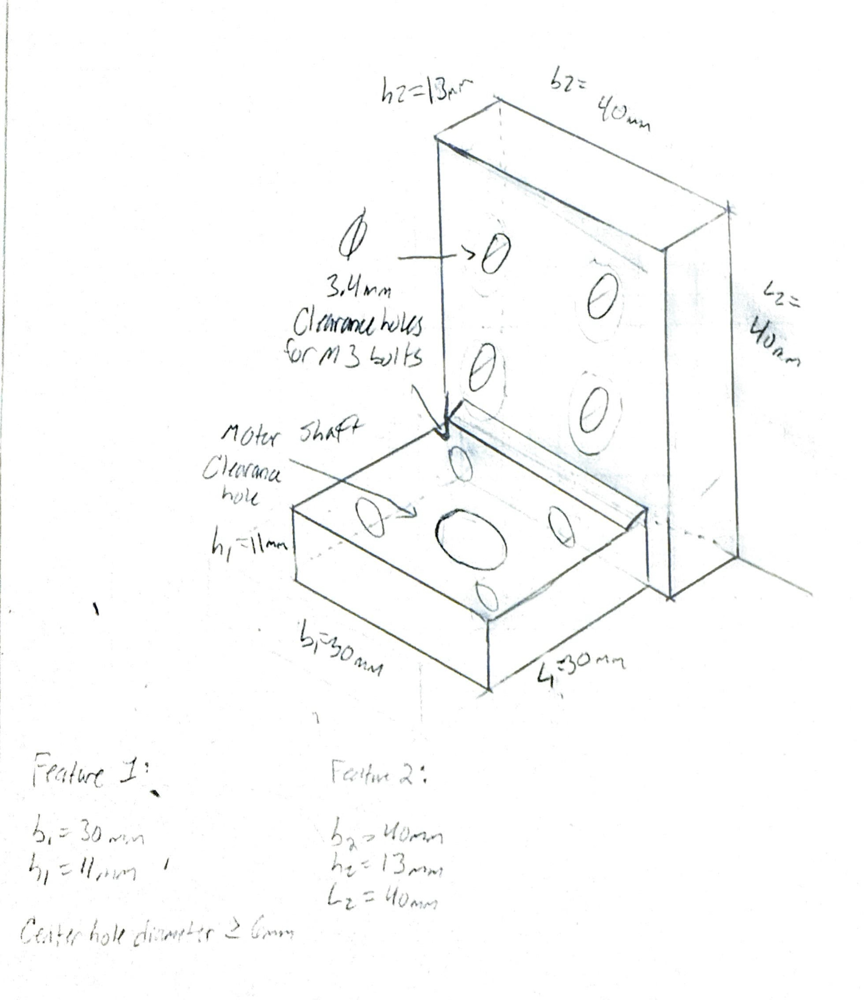
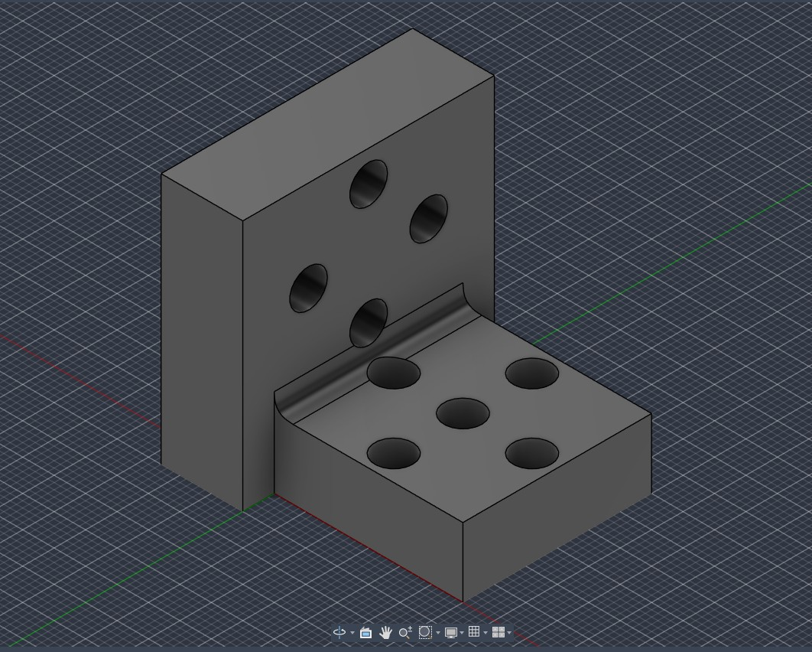
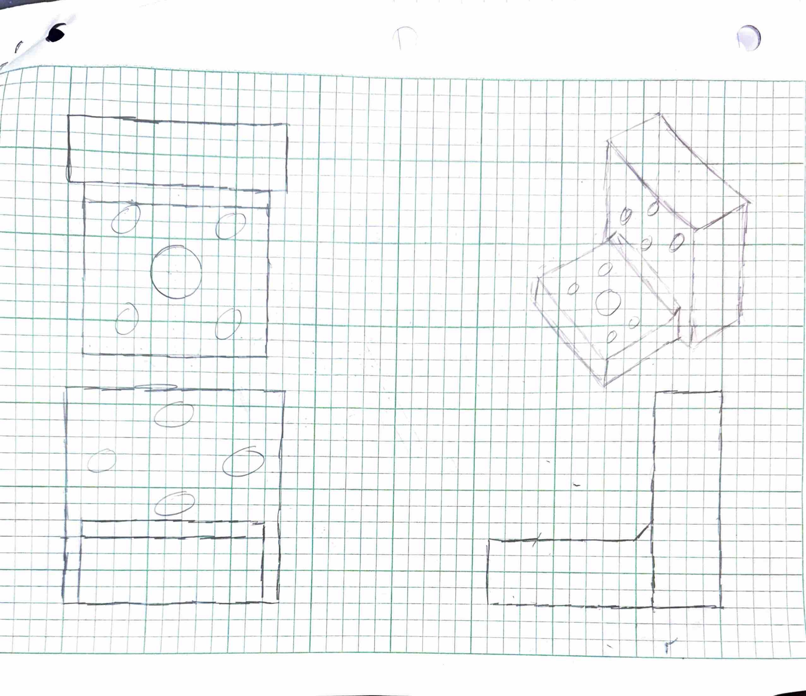

# A4: Motor Mount

---

## Process Overview & Documentation
* **Material Selected**: PLA (&sigma;y &approx; 50 MPa, *E* &approx; 3.5 GPa)
* **Design Load (*P*)**: 300 N applied at motor shaft free end
* **Safety Factor (*n*)**: 3
* **Max Deflection Limit (&delta;max)**: 0.30 mm (3.0 &times; 10-4 m)
* **Total Project Time**: 7.5 Hours

---

## Feature 1

### Knowns & Unknowns
* **Known Parameters**:
  * Applied Shaft Load (*P*): 300 N
  * Safety Factor (*n*): 3
  * Maximum Allowable Deflection (&delta;max): 0.30 mm
  * Material (PLA): Yield Strength &sigma;y = 50 MPa, Elastic Modulus *E* = 3.5 GPa
  * Allowable Design Stress (&sigma;allow):
    &sigma;allow = &sigma;y / *n* = 50 MPa / 3 &approx; 16.67 MPa
  * Feature Length (*L*1): 30 mm (0.03 m)
  * Feature Width (*b*1): 30 mm (0.03 m)
* **Unknowns**:
  * Cross-sectional thickness (*h*1) required to satisfy yield strength and deflection criteria.

### Free Body Diagram (FBD)
  
*Figure 1: Free body diagram of Feature 1 modeled as a cantilever beam with fixed reaction moment Mmax = P &times; L1 and vertical reaction force Ry = P = 300 N.*

### Symbolic Modeling

  

1. **Section Moment of Inertia**:
   *I*1 = (*b*1 &times; *h*13) / 12

2. **Bending Stress Equation**:
   *M*max = *P* &times; *L*1  
   &sigma;max = (*M*max &times; (*h*1 / 2)) / *I*1 = (6 &times; *P* &times; *L*1) / (*b*1 &times; *h*12)  
   &sigma;max &le; &sigma;allow &rArr; (*b*1 &times; *h*12) &ge; (18 &times; *P* &times; *L*1) / &sigma;y

3. **Deflection Equation**:
   &delta;max = (*P* &times; *L*13) / (3 &times; *E* &times; *I*1) = (4 &times; *P* &times; *L*13) / (*E* &times; *b*1 &times; *h*13)  
   &delta;max &le; 0.30 mm &rArr; (*b*1 &times; *h*13) &ge; (4 &times; *P* &times; *L*13) / (*E* &times; &delta;allow)

### Numerical Solution

  

* **Yield Stress Constraint**:
  *b*1 &times; *h*12 &ge; (18 &times; 300 &times; 0.03) / (50 &times; 106) = 3.24 &times; 10-6 m3  
  *h*1 &ge; &radic;((3.24 &times; 10-6) / 0.03) = 0.0104 m = **10.4 mm**

* **Deflection Constraint**:
  *b*1 &times; *h*13 &ge; (4 &times; 300 &times; 0.033) / ((3.5 &times; 109) &times; (3.0 &times; 10-4)) = 3.086 &times; 10-8 m4  
  *h*1 &ge; 3&radic;((3.086 &times; 10-8) / 0.03) = 0.0101 m = **10.1 mm**

* **Governing Dimension**: Yield stress governs (10.4 mm > 10.1 mm). 
* **Final Chosen Dimension**: *h*1 = **11 mm**

---

## Feature 2

### Knowns & Unknowns
* **Known Parameters**:
  * Transferred Shaft Load (*P*): 300 N
  * Material (PLA): *E* = 3.5 GPa, &sigma;y = 50 MPa, *n* = 3, &sigma;allow = 16.67 MPa
  * Allowable Deflection (&delta;max): 0.30 mm
  * Wall Attachment Interface: M3 bolts into Rigid Wall A (3.4 mm clearance holes)
  * Feature Length (*L*2): 40 mm (0.04 m)
  * Feature Width (*b*2): 40 mm (0.04 m)
* **Unknowns**:
  * Wall plate thickness (*h*2) to satisfy yield strength and deflection limits.

### Free Body Diagram (FBD)
  
*Figure 2: Free body diagram of Feature 2 attaching to Rigid Wall A showing internal shear force V(x) and bending moment M(x) distribution.*

### Symbolic Modeling

  

1. **Section Moment of Inertia**:
   *I*2 = (*b*2 &times; *h*23) / 12

2. **Bending Stress Equation**:
   &sigma;max = (6 &times; *P* &times; *L*2) / (*b*2 &times; *h*22) &le; &sigma;allow &rArr; (*b*2 &times; *h*22) &ge; (18 &times; *P* &times; *L*2) / &sigma;y

3. **Deflection Equation**:
   &delta;max = (4 &times; *P* &times; *L*23) / (*E* &times; *b*2 &times; *h*23) &le; &delta;allow &rArr; (*b*2 &times; *h*23) &ge; (4 &times; *P* &times; *L*23) / (*E* &times; &delta;allow)

### Numerical Solution

  

* **Yield Stress Constraint**:
  *b*2 &times; *h*22 &ge; (18 &times; 300 &times; 0.04) / (50 &times; 106) = 4.32 &times; 10-6 m3 &rArr; *h*2 &ge; **10.4 mm**

* **Deflection Constraint**:
  *b*2 &times; *h*23 &ge; (4 &times; 300 &times; 0.043) / ((3.5 &times; 109) &times; (3.0 &times; 10-4)) = 7.314 &times; 10-8 m4 &rArr; *h*2 &ge; **12.2 mm**

* **Governing Dimension**: Deflection governs (12.2 mm > 10.4 mm).
* **Final Chosen Dimension**: *h*2 = **13 mm**

---

## Sketch

Below is the isometric hand sketch showing the fully dimensioned motor mount assembly incorporating the four M3 motor plate holes, central motor shaft clearance hole, four M3 wall attachment clearance holes, and a corner fillet transition.

  
*Figure 3: Isometric hand sketch with explicit dimension callouts (b1 = 30 mm, h1 = 11 mm, b2 = 40 mm, h2 = 13 mm, L2 = 40 mm).*

---

## CAD Model (Parametric)

The 3D model was constructed parametrically in Fusion 360 using driving global parameters to ensure automatic geometry updates.

### Parametric Table
| Parameter Name | Expression | Description |
| :--- | :--- | :--- |
| `b1` | `30 mm` | Feature 1 Width |
| `h1` | `11 mm` | Feature 1 Thickness |
| `L1` | `30 mm` | Feature 1 Length |
| `b2` | `40 mm` | Feature 2 Width |
| `h2` | `13 mm` | Feature 2 Thickness |
| `L2` | `40 mm` | Feature 2 Length |
| `hole_wall` | `3.4 mm` | Wall M3 Bolt Clearance |
| `hole_motor` | `3.4 mm` | Motor Plate M3 Bolt Clearance |
| `hole_shaft` | `6.0 mm` | Center Shaft Clearance |
| `bc_diameter`| `22.0 mm`| Motor Mounting Bolt Circle |
| `fillet_rad` | `3.0 mm` | Fillet Radius |

### CAD Renders & Features
To reduce stress concentrations under the 300 N shaft load, a 3 mm fillet was modeled at the internal 90° junction.

  
*Figure 4: Parametric CAD model rendered in Fusion 360 showing clearance holes and internal corner fillet.*

### CAD File Download
* [Download STEP Model (.step)](Motor_Mount.step)
* [Download STL Model (.stl)](Motor_Mount.stl)

---

## MEGR 2157 Multiview Drawing

The Third-Angle Projection engineering drawing sheet includes Front, Top, Right Side, and Shaded Isometric views, fully dimensioned per ASME standards with proper centerlines, center marks, and hole callouts.

  
*Figure 5: ASME Third-Angle Projection multiview drawing generated in Fusion 360.*

* [Download Drawing Sheet PDF](IsomatricMotor.pdf)

---

## Lessons Learned

### Key Takeaways
1. **Deflection vs. Stress Limits**: While yield stress governed the required thickness for Feature 1 (10.4 mm vs 10.1 mm), beam deflection governed Feature 2 (12.2 mm vs 10.4 mm) due to length scaling cubed (&delta; &prop; *L*3).
2. **Parametric Modeling Discipline**: Defining a construction circle centered at the origin for the 22 mm bolt circle diameter allowed seamless parametric updates without breaking hole dependencies.
3. **Stress Relief**: Modeling a transition fillet at the interior corner significantly reduces localized stress concentration at the right-angle bend.

### Time Log
* **Analysis & Symbolic Math**: 2.5 Hours
* **FBDs & Hand Sketching**: 1.0 Hour
* **Fusion 360 Parametric CAD**: 2.0 Hours
* **MEGR 2157 Multiview Drawing**: 1.0 Hour
* **Portfolio Documentation**: 1.0 Hour
* **Total Time**: **7.5 Hours**

---

## Appendix

### Reference Research Links
* [Servocity Planetary Gear Motor Mount Options](https://www.servocity.com)
* [McMaster-Carr Bracket Structural Fastener Design Guide](https://www.mcmaster.com)
* [Beam Deflection Tables – Machinery's Handbook (p. 256 - 274)](https://instructure.charlotte.edu/courses/272052/assignments/2902671)
