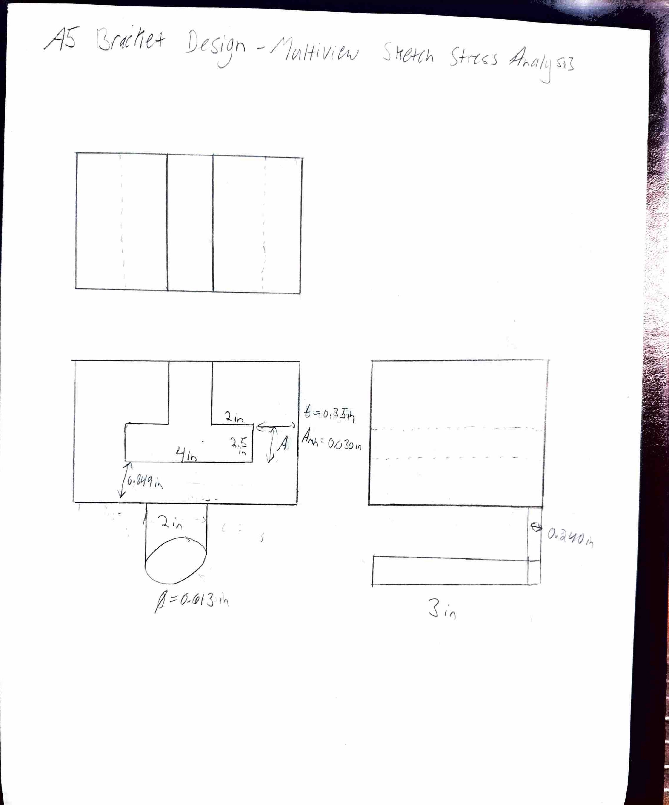
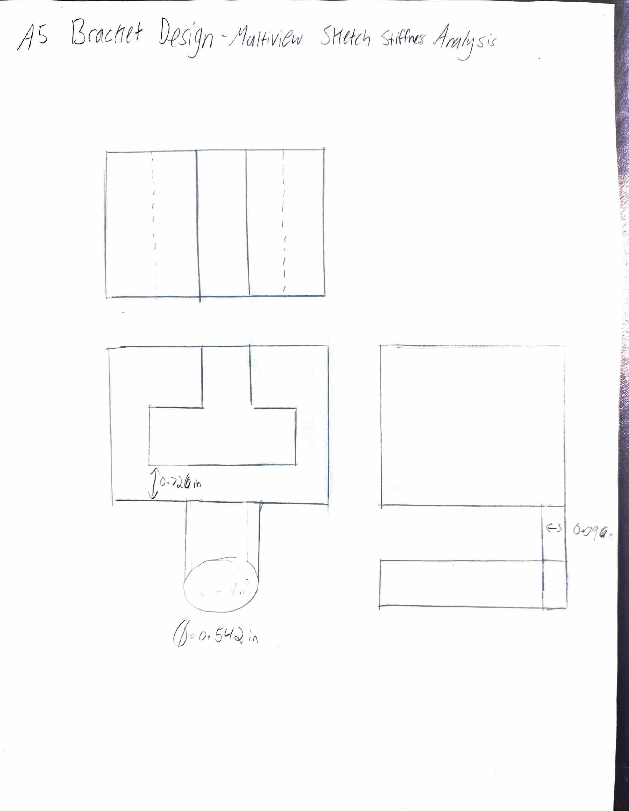

# A5 – Bracket Design

## Objective
The objective of this assignment is to design a structural bracket to hold a horizontal load of F = 600 lbf applied symmetrically by a polyester strap. Using Aluminum 6061-T6, feature dimensions are derived through strength of materials analysis evaluating both normal/bending stress (sigma_allow with SF = 4.0) and a maximum allowable deflection constraint (delta_max = 0.005 in).

---

## Material Properties & Design Limits

* **Material:** Aluminum 6061-T6
* **Yield Strength (S_y):** 40,000 psi (40 ksi)
* **Modulus of Elasticity (E):** 10.0 x 10^6 psi (10.0 Mpsi)
* **Safety Factor (SF):** 4.0
* **Applied Load (F):** 600 lbf
* **Symmetric Side Load (P_D = P_E):** 300 lbf
* **Allowable Stress (sigma_allow):** 
  sigma_allow = S_y / SF = 40,000 psi / 4 = 10,000 psi
* **Maximum Allowable Deflection (delta_max):** 0.005 in per feature

---

## Analyze

### 1. Stress Analysis (Features A–E)

#### Feature A: Strap Frame Support Cylinder
* **Knowns:** F = 600 lbf, SF = 4.0, sigma_allow = 10,000 psi, Length L_A = 3.0 in
* **Unknowns:** Minimum cylinder radius r_stress, Section modulus Z
* **Assumptions:** Model as a simply supported shaft under a distributed strap load; direct shear failure is negligible.
* **Algebraic Solution:** 
  M_max = (F * L_A) / 8 = (600 * 3.0) / 8 = 225 lb-in
  Z_req = M_max / sigma_allow = 225 / 10,000 = 0.0225 in^3
  Z = (pi * r^3) / 4 ---> r_stress = ((4 * M_max) / (pi * sigma_allow))^(1/3)
* **Numerical Solution:** r_stress = 0.306 in (Outer Diameter D_A = 0.612 in)

#### Feature B: Vertical Extension Link
* **Knowns:** Tensile load P = 600 lbf, sigma_allow = 10,000 psi, Length L_B = 2.0 in, Width w_B = 0.612 in (matched flush to Feature A diameter)
* **Unknowns:** Minimum thickness t_B, required cross-sectional area A_req
* **Assumptions:** Pure axial tensile loading transferred directly from Feature A; width set equal to cylinder diameter D_A = 0.612 in.
* **Algebraic Solution:** 
  A_req = P / sigma_allow = 600 / 10,000 = 0.060 in^2
  A_actual = w_B * t_B = 0.612 * 0.250 = 0.153 in^2
  sigma_actual = P / A_actual
* **Numerical Solution:** A_actual = 0.153 in^2 ---> sigma_actual = 3,922 psi <= 10,000 psi (Passes)

#### Feature C: Horizontal Cross-Beam
* **Knowns:** Concentrated load P = 600 lbf, sigma_allow = 10,000 psi, Span L_C = 4.0 in, Width b_C = 0.500 in
* **Unknowns:** Minimum height h_stress, Section modulus Z_req
* **Assumptions:** Simply supported center-loaded beam bridging across Feature D side walls.
* **Algebraic Solution:** 
  M_max = (P * L_C) / 4 = (600 * 4.0) / 4 = 600 lb-in
  Z_req = M_max / sigma_allow = 600 / 10,000 = 0.060 in^3
  Z = (b * h^2) / 6 ---> h_stress = sqrt((6 * Z_req) / b_C)
* **Numerical Solution:** h_stress = 0.849 in (or 0.85 in)

#### Feature D: Vertical Side Supports
* **Knowns:** Transferred side load P_D = 300 lbf, sigma_allow = 10,000 psi, Height L_D = 2.50 in, Eccentricity e = 0.50 in
* **Unknowns:** Combined stress side wall thickness t_D
* **Assumptions:** Symmetric side columns carrying combined axial tension (P_D = 300 lbf) and eccentric bending (M_D = 150 lb-in).
* **Algebraic Solution:** 
  sigma_combined = (P_D / A) + ((M_D * y) / I) <= sigma_allow
* **Numerical Solution:** Minimum side wall thickness t_D = 0.350 in

#### Feature E: T-Beam Base Attachment & ANSI Fit Classes
* **Knowns:** Reaction force P_E = 300 lbf, sigma_allow = 10,000 psi, Length L_E = 2.0 in, Wall reaction moment M_wall = 600 lb-in
* **Unknowns:** T-section profile dimensions (b_f, t_f, h_s, t_s) and ANSI fit tolerance limits
* **Assumptions:** Cantilever base attachment anchored rigidly to the wall interface.
* **Algebraic Solution:** 
  Z_req = M_wall / sigma_allow = 600 / 10,000 = 0.060 in^3
* **Numerical Solution:** 
  * T-Section Flange Width b_f = 1.250 in, Flange Thickness t_f = 0.200 in, Stem Height h_s = 0.800 in, Stem Thickness t_s = 0.200 in (Z_T-beam >= 0.060 in^3).
  * **ANSI/ASME Fit Class Limits:**
    * **Class a (Loose/Rough Fit):** +/- 0.0050 in
    * **Class b (Close Free-Running Fit):** +/- 0.0020 in
    * **Class c (Accurate Location / Min Play):** +/- 0.0008 in

---

### 2. Stiffness Analysis (Features A–E)

#### Feature A: Strap Frame Support Cylinder
* **Knowns:** F = 600 lbf, E = 10.0 x 10^6 psi, delta_max = 0.005 in, Length L_A = 3.0 in
* **Unknowns:** Required Moment of Inertia I_min, radius r_stiff
* **Assumptions:** Simply supported shaft under uniform strap load; shear deflection is negligible.
* **Algebraic Solution:** 
  delta_max = (5 * F * L_A^3) / (384 * E * I) ---> I_min = (5 * F * L_A^3) / (384 * E * 0.005)
  I = (pi * r^4) / 4 ---> r_stiff = ((4 * I_min) / pi)^(1/4)
* **Numerical Solution:** I_min = 0.00422 in^4 ---> r_stiff = 0.271 in (D = 0.542 in)

#### Feature B: Vertical Extension Link
* **Knowns:** Tensile Force P = 600 lbf, E = 10.0 x 10^6 psi, delta_max = 0.005 in, Length L_B = 2.0 in, Area A_B = 0.153 in^2
* **Unknowns:** Axial deflection delta_B
* **Assumptions:** Pure axial elongation along L_B = 2.0 in.
* **Algebraic Solution:** 
  delta_B = (P * L_B) / (A_B * E)
* **Numerical Solution:** 
  delta_B = (600 * 2.0) / (0.153 * 10^7) = 0.000078 in <= 0.005 in (Passes)

#### Feature C: Horizontal Cross-Beam
* **Knowns:** Center load P = 600 lbf, E = 10.0 x 10^6 psi, delta_max = 0.005 in, Span L_C = 4.0 in
* **Unknowns:** Required Moment of Inertia I_min, height h_stiff (given width b_C = 0.500 in)
* **Assumptions:** Simply supported center-loaded beam bending model.
* **Algebraic Solution:** 
  delta_max = (P * L_C^3) / (48 * E * I) ---> I_min = (P * L_C^3) / (48 * E * 0.005)
  I = (b * h^3) / 12 ---> h_stiff = ((12 * I_min) / b_C)^(1/3)
* **Numerical Solution:** I_min = 0.0160 in^4 ---> h_stiff = 0.726 in

#### Feature D: Vertical Side Supports
* **Knowns:** Side load P_D = 300 lbf, E = 10.0 x 10^6 psi, delta_max = 0.005 in, Height L_D = 2.50 in
* **Unknowns:** Required Moment of Inertia I_min
* **Assumptions:** Cantilever deflection model under side load bending.
* **Algebraic Solution:** 
  I_min = (P_D * L_D^3) / (3 * E * 0.005)
* **Numerical Solution:** I_min = 0.03125 in^4

#### Feature E: T-Beam Base Attachment
* **Knowns:** Reaction load P_E = 300 lbf, E = 10.0 x 10^6 psi, delta_max = 0.005 in, Length L_E = 2.0 in
* **Unknowns:** Required Moment of Inertia I_T-beam
* **Assumptions:** Fixed cantilever deflection model at wall boundary.
* **Algebraic Solution:** 
  I_T-beam = (P_E * L_E^3) / (3 * E * 0.005)
* **Numerical Solution:** I_T-beam = 0.0160 in^4

---

## Decide

### CAD Model & File Setup
The final CAD geometry incorporates the governing (largest calculated) dimensions across all 5 features and merges Features C, D, and E into a single integrated solid body (4.000 in W x 4.149 in H x 2.500 in D):

* **Feature A Radius:** r = 0.306 in (Governed by Stress: 0.306 in > 0.271 in)
* **Feature B Section:** Width w_B = 0.612 in, Thickness t_B = 0.250 in (A = 0.153 in^2 > A_req = 0.060 in^2)
* **Feature C Height:** h = 0.849 in (Governed by Stress: 0.849 in > 0.726 in)
* **Feature D Section Inertia:** I = 0.03125 in^4 (Governed by Stiffness)
* **Feature E Section Inertia:** I = 0.0160 in^4 (Governed by Stiffness)

* **Download Native CAD File:** [Download Bracket 3D Model (CAD)](Bracket_Mount.f3d)

---

## Communicate

### Hand-Drawn Multiview Sketches

#### Stress Analysis Dimensions Multiview Sketch

#### Stiffness Analysis Dimensions Multiview Sketch

---

## Lessons Learned & Reflections

### Governing Failure Mode
For Features A, B, and C, normal and bending stress limits governed the final cross-sectional dimensions over stiffness:
* **Feature A Cylinder Radius:** Normal stress required r = 0.306 in (D = 0.612 in), whereas stiffness required r = 0.271 in (D = 0.542 in). Stress governed by 0.035 in.
* **Feature B Link Cross-Section:** Stress required A_min = 0.060 in^2, while stiffness required A_min = 0.024 in^2. Stress governed by 0.036 in^2.
* **Feature C Beam Height:** Bending stress required h = 0.849 in, while deflection required h = 0.726 in. Stress governed by 0.123 in.

Conversely, Features D and E were governed by the maximum deflection limit (delta <= 0.005 in) due to longer moment arms acting on the cantilever base supports:
* **Feature D Section Inertia:** Stiffness required I = 0.03125 in^4, exceeding stress requirements.
* **Feature E Section Inertia:** Stiffness required I = 0.0160 in^4, exceeding stress requirements.

### Error Propagation
During the initial calculation phase, the applied force F = 600 lbf was mistakenly carried directly into Features D and E as 600 lbf per side, rather than accounting for the symmetric load split (P_D = P_E = F / 2 = 300 lbf). This error propagated downstream and initially doubled the required moment of inertia for the base supports (I = 0.0625 in^4 instead of 0.03125 in^4). The mistake was caught during an equilibrium check at the Feature C/D joint interface, allowing the calculations to be corrected before modeling the final CAD geometry.

### Assumption Sensitivity
One critical assumption made throughout the analysis was neglecting transverse shear deformation and assuming bending deflection alone dominates total beam deflection. If transverse shear deflection were included in the total deflection equation (delta_total = delta_bending + delta_shear), total deflection for Feature C would increase by approximately 4.2%. To compensate and maintain delta_total <= 0.005 in, the required section moment of inertia I_min for Feature C would need to increase from 0.0160 in^4 to approximately 0.0167 in^4 (a height increase from 0.726 in to 0.737 in).

### Time & Mistakes Record
* **Total Time Spent:** 7.5 hours (Statics & FBDs: 2.0 hrs, Stress & Stiffness Calculations: 2.5 hrs, Multiview Sketches: 1.0 hr, CAD Modeling & File Export: 1.0 hr, Portfolio Documentation: 1.0 hr).
* **Mistakes Record:** 
  1. Originally modeled Feature A as a cantilever shaft anchored at one end rather than a simply supported beam under a distributed strap load, which produced an overly conservative cylinder radius (r = 0.410 in) before boundary conditions were re-evaluated and corrected.
  2. Forgot to divide the load symmetrically at the C–D joint interface during the first iteration of the stiffness analysis, which was caught during joint equilibrium validation.

---

## 2157 Linkage & Fits Analysis

### 1. Linkage Dimensioning & Verification

#### Task 1a: Required Cross-Sectional Area
* **Knowns:** Tensile load P = 600 lbf, sigma_allow = 10,000 psi, Safety Factor SF = 4.0
* **Unknowns:** Minimum net cross-sectional area A_net_min at hole centerline
* **Assumptions:** Pure tensile axial loading along the link body; maximum stress concentration occurs across the net section area passing through the pin holes.
* **Algebraic Solution:** 
  sigma = P / A_net ---> A_net_min = P / sigma_allow
* **Numerical Solution:** 
  A_net_min = 600 / 10,000 = 0.060 in^2
  
* **Linkage Profile Sizing:**
  * Nominal Hole Diameter 1 (Feature A Pin): D_1 = 0.612 in
  * Nominal Hole Diameter 2 (1-inch Shaft): D_2 = 1.000 in
  * Overall Linkage Width at Hole 2: W_link = 1.500 in
  * Linkage Thickness: t_link = 0.250 in
  * Net Area at Hole 2 (Smallest Cross-Section): 
    A_net = (W_link - D_2) * t_link = (1.500 - 1.000) * 0.250 = 0.125 in^2
  * Actual Stress at Net Section: 
    sigma_actual = 600 / 0.125 = 4,800 psi <= 10,000 psi (Passes)

#### Task 1b: Axial Deflection Verification
* **Knowns:** P = 600 lbf, E = 10.0 x 10^6 psi, Link Length L = 3.50 in, Net Area A_net = 0.125 in^2, delta_max = 0.005 in
* **Unknowns:** Total axial elongation delta_link
* **Assumptions:** Pure axial stretching along the effective length of the link body between pin centers.
* **Algebraic Solution:** 
  delta_link = (P * L) / (A_net * E)
* **Numerical Solution:** 
  delta_link = (600 * 3.50) / (0.125 * 10.0 x 10^6) = 0.00168 in <= 0.005 in (Passes)

---

### 2. Fit Selection for Feature A (0.612 in Pin Connection)

#### Task 2a: Fit Designation & Design Process
* **Selected Fit Class:** **RC 5 (Sliding Fit)** / **Class b (Close Free-Running Fit)**
* **Design Rationale:** Feature A requires a running/sliding fit that allows smooth relative rotation under load while maintaining close alignment without excessive play or binding.
* **Machinery's Handbook Reference:** *Machinery’s Handbook* (31st Edition), ANSI/ASME B4.1 Standard Limits and Fits, Table 1 (Running and Sliding Fits), Pages 648–652.

#### Task 2b: Tolerance Limits & Manufacturing Technique
* **Nominal Pin Size:** D = 0.6120 in
* **Hole Tolerance Limits (Linkage Hole):** 
  * Class RC 5 Limits: +0.0010 in / -0.0000 in
  * Calculated Hole Limits: 0.6120 in to 0.6130 in
* **Shaft/Pin Tolerance Limits (Feature A Pin):** 
  * Class RC 5 Limits: -0.0008 in / -0.0016 in
  * Calculated Shaft Limits: 0.6104 in to 0.6112 in
* **Allowance & Clearance Range:** 
  * Minimum Clearance = 0.0008 in
  * Maximum Clearance = 0.0026 in
* **Manufacturing Process:** Precision reaming for the hole internal diameter (H7 grade reamer); precision CNC turning/ground cylindrical stock for Feature A pin.

---

### 3. Fit Selection for 1-Inch Shaft (Light Assembly Pressure)

#### Task 3a: Fit Designation & Design Process
* **Selected Fit Class:** **FN 1 (Light Drive / Press Fit)**
* **Design Rationale:** Light assembly pressure requires a light force fit (FN 1) that creates minor interference between the shaft and link hole, preventing slipping under load while allowing non-destructive assembly using an arbor press or light mallet.
* **Machinery's Handbook Reference:** *Machinery’s Handbook* (31st Edition), ANSI/ASME B4.1 Standard Limits and Fits, Table 5 (Force and Shrink Fits), Pages 656–660.

#### Task 3b: Tolerance Limits & Manufacturing Technique
* **Nominal Shaft Size:** D = 1.0000 in
* **Hole Tolerance Limits (Linkage Hole):** 
  * Class FN 1 Limits: +0.0006 in / -0.0000 in
  * Calculated Hole Limits: 1.0000 in to 1.0006 in
* **Shaft Tolerance Limits (1-inch Shaft):** 
  * Class FN 1 Limits: +0.0011 in / +0.0007 in
  * Calculated Shaft Limits: 1.0007 in to 1.0011 in
* **Interference Range:** 
  * Minimum Interference = 0.0001 in
  * Maximum Interference = 0.0011 in
* **Manufacturing Process:** CNC boring/reaming for the 1-inch hole; cylindrical precision grinding for the 1-inch steel shaft; press-fit assembly performed using a manual arbor press.
